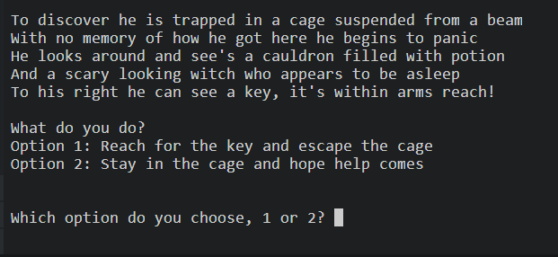

# ESCAPE THE WITCHES GARDEN

A fun game about escaping the Witches garden, your job is to help Jimmy make the right decisions and escape the evil witches garden and get to safety! It is a text-based adventure game using Python were the player is required to select an answer from the options within each section of the game.

 ## Project Audience and target goals.
- Completed goals:
   * Built a fun text-based game using Python that lets you choose different options which results in different outcomes.
   
 - Future goals:
   * Add additional paths that could link up to other paths within the game.
   * Add collective items to be used during game play.
   * Add HTML and CSS styling to game to make it more visually stimulating.

  - Audience: 

    * This game is designed mostly for a younger audience but can be played by all ages, its an interesting way to show younger players how text based games are created.

    ## Lucid chart 
   * Escape the witches garden is a text-based game, for this reason no work was done for creating front end styling using HTML and CSS. Instead focus was put on creating a diagram of the application and using that as a base for creating the code.
     

 ## User Experience 
  ### First time playing
  - As a first time player I want to understand the main purpose of the site and have an enjoyable experience playing a text-based game.
  - At entry the player is greeted with a welcoming message and the rules of the game are explained easily.
  - The player is then asked to enter their player name and the game begins.
  - The game runs at a comfortable speed allowing the player to read the story easily as they progress.
  - A different color of text is used for each character, this makes it easier for the player to differ from story line to characters speaking making it easier to follow.
  
  ### Returning player
   - As a returning player I want to attempt to play the game better than the first, by choosing different inputs and seeing the different out put results.
   - The returning player will be more familiar with the paths and will know which path they should not take from previous game play. 

   ## Game play

### Welcome section
- Here the player is greeted with the welcome message and the rules of the game are explained, they are then required to enter their player name using letters and numbers only, a message will be displayed if any symbols or blank spaces are entered.

### Witches house
- Here is the first chapter of the game, there is some story line which is displayed and the player is asked to choose an option, each option resulting in a different outcome.

###  Witches garden
- The next section of the game is the witches garden, this section is reached only if the player selects the correct option from the first chapter, the player is greeted by a crow and is given three options to choose from.

### Crows path
- Should the player choose the crows path they follow the crows story line, here there are only two options.

### Candy bush
- Here there is more story line to follow and the player is asked to choose from the two options.

### Crows trap
- In this section there are no options for the player to choose from there is just the story line to follow.

### Own path
- Here you will to make Jimmy choose between three options, only one will get Jimmy through to the next section.

### Cyclops battle 
- Here the player will encounter a giant cyclops, from the two options provided they will need to select the correct one to escape the cyclops.

###  Escape garden
- The last section of the successful path and the player has three options to choose from, only one of them will result in Jimmy escaping the garden.

## Testing

  ### PEP8
  - Python Linter was used to test the code and on final testing there are no errors.

 - I have carried out extensive testing with this project this includes running through the program ensuring each out come responds correctly, below I have shown the options chosen in game play marked with a tick to show it works
 - [x] 1,1,1,1
 - [x] 1,1,2,2
 - [x] 2
 - [x] 1,3
 - [x] 1,2,1
 - [x] 1,2,3
 - [x] 1,2,2,1
 - [x] 1,2,2,2,1
 - [x] 1,2,2,2,2
 - [x] 1,2,2,2,3
 - [x] Tested code on player name to only accept numbers or letters.
 - [x] Tested code for options input to only accept the option numbers provided.

 ## Bugs
Solved bugs
 - While testing the code I had an issue with the input section for the questions, it was allowing the player to input a single letter or a number that wasn't in the options. This was resolved using a While loop and using the break/continue.
 - There were a few lines of code that were too long, this was corrected by using "\n" to create a new line.
 - While testing the code for the username input the code was continuously repeating the Welcome and the user name, this was resolved by using break after to exit the loop. 

## Unfixed bugs
   - There are no unfixed bugs.

## Deployment
The website was deployed using Heroku with the following steps

 - Login to Heroku (Create an account if necessary)
  -   Click New in the Heroku dashboard and select "Create new app."
  -   Write a name for the app and choose your region and click "Create App."
  -   In the settings tab for the new application, created one Config name PORT and has a value of 8000.
  -   Add two build pack scripts: Python and Nodejs (in that order)
  -   Connect your Heroku with your GitHub account and the repository you are working with.
  - At the bottom, you can do a manual deployment or set it to automatic deployment to deploy every time your repo is updated.

